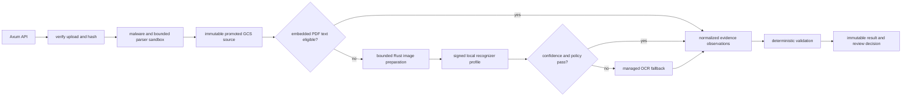

# ADR-0012: Durable hybrid OCR execution

## Status

Proposed. Implementation and review are tracked in GitHub issue #46.

## Context

The reusable document-intelligence service must process 20 submitted jobs per
second per region, tolerate bursts to 50, and safely handle one to 300 pages
per job. Control-plane availability targets 99.9% monthly with p99 below 500
ms; eligible interactive documents target p95 below 10 seconds after the
recognizer profile is benchmarked. A source document can be 100 MiB, and a
single failed page must not discard successful page artifacts.

Digital PDFs may contain useful embedded text while photographed or scanned
pages require raster OCR. Treating either route as authoritative without
provenance loses evidence. Sending every page to a managed provider is costly,
adds residency and availability dependencies, and makes local quality
improvement impossible. Allowing a request to choose an arbitrary model,
provider URL, namespace, object path or execution profile creates a tenancy
and supply-chain boundary failure.

The trust boundary crosses the Rust API, CNPG, GCS, parser sandbox, local
recognizer, managed fallback, Temporal and agent callers. Document bytes,
recognized text, source object locators, signed URLs, model material and
credentials are sensitive. They must not enter ordinary logs, trace attributes
or Temporal history.

## Decision

Use a hybrid, evidence-first pipeline. Rust owns API validation, immutable
provenance, page preparation, local model execution, provider routing,
normalization, deterministic validation and all public contracts. A managed
Document AI provider is available only as a policy-controlled fallback for a
page that is low confidence, handwriting/locale unsupported, or requires a
profile unavailable locally.

The primary path is:

### Authoritative source binding

CNPG stores an accepted source locator joined to the job's verified product,
tenant and upload. It includes bucket, object name, immutable generation,
SHA-256 digest, content length, verified MIME type and parser limits. The page
runner obtains this locator from the scoped store, not from a workflow payload
or request. GCS reads must pin the accepted generation and verify the expected
digest before page rendering. A source lookup for another tenant or product
returns no result.

### Recognition and provider routing

The parser tries embedded digital-PDF text before raster OCR. Raster work
performs bounded decode, orientation, quality assessment, geometry transforms
and preprocessing outside Tokio executor threads. The local recognizer accepts
only an approved detached-signed model profile and matching digest-pinned
artifact. It uses bounded CPU and accelerator pools, pixel-budget admission,
page-level parallelism and bounded shape batches. It emits typed regions,
lines, words, coordinates, confidence and transform provenance.

The routing policy receives only trusted metadata and local observations. It
considers tenant/provider policy, data residency, locale/profile support,
quality, confidence, document class, provider health, latency budget and cost
budget. It cannot receive a caller-supplied endpoint, credentials, model path
or provider instruction. Managed fallback has a deadline, circuit breaker,
bounded retries and tenant-specific concurrency/cost limits. Its output is
validated into the same provider-neutral observation graph; it never replaces
or erases source evidence.

### Temporal namespace and durability

Every environment uses an isolated Temporal namespace named
`document-intelligence-<environment>`. The worker rejects `default` and any
unrelated namespace at startup. Namespace creation, retention and access
policy are delivered through reviewed platform GitOps; application startup
does not create or mutate namespaces.

Temporal workflow inputs, activity inputs and history contain only schema
version, product ID, tenant ID, job ID, page count and bounded state. CNPG is
the authority for page attempts, durable checkpoints and terminal state;
Temporal owns orchestration, cancellation delivery, retrying unknown durable
transitions and worker-version routing. Each page has a deterministic activity
key. Successful page artifacts are immutable and idempotent, allowing partial
recovery without repeating unaffected pages. Long workflows continue-as-new
before the bounded history threshold.

### Data and cache ownership

CNPG is authoritative for job metadata, accepted source binding, review
decisions, validation state, outbox and audit records. GCS holds immutable
source, page and result artifacts. Valkey holds tenant- and version-scoped
expiring admission and content-hash cache entries; an outage bypasses the
cache and applies conservative local admission. Qdrant holds rebuildable
derived semantic memory with tenant/region filters and retention metadata.

The OCR cache key is the SHA-256 source digest plus model-profile, parser,
policy, normalization and schema versions, all prefixed by tenant and region.
No cache contains credentials. No cache may be shared across tenants.

## Failure behaviour

| Dependency failure | Behaviour |
| --- | --- |
| CNPG unavailable | Do not start recognition; Temporal retries only the unknown durable transition. |
| GCS generation/digest mismatch | Permanently reject the page/job as an immutable-source integrity failure. |
| Parser/decoder bound exceeded | Reject the document with a typed quality or limit outcome; do not silently enhance it. |
| Local model unavailable | Route only if managed fallback policy permits; otherwise retain a typed retry/review outcome. |
| Managed fallback unavailable | Open its circuit, preserve local evidence, and retry/review according to policy. |
| Temporal unavailable | Do not lose accepted work; CNPG/outbox remains durable and workers reconnect with bounded backoff. |
| Valkey/Qdrant/Langfuse unavailable | OCR correctness continues without cache, memory or telemetry enrichment. |

## Evaluation and promotion

Every profile/provider candidate is evaluated against versioned, legally
usable golden cohorts for clean PDFs, scans, mobile images, handwriting,
tables, mixed locales, poor quality and adversarial prompt-injection content.
Release reports measure CER, WER, critical-field exact match, table-cell
accuracy, confidence calibration, p50/p95/p99 latency, pages per second,
memory, fallback rate, cost per successful page and unsafe auto-accept rate.

DevAI sandbox traces use product-scoped development telemetry credentials and
redacted identifiers. Production traces use the calling product's scoped
identity and production telemetry credentials. No trace is used as training
data until it is redacted, reviewed, labelled and promoted into a versioned
golden dataset. Promotion sequence is sandbox, offline evaluation, shadow,
canary and production.

## Consequences

The service keeps a cheap, low-latency local route while retaining a measured
high-accuracy fallback for difficult pages. It requires model-signing
governance, profile benchmark evidence, provider tenancy/residency controls,
Temporal namespace operations, and real replay/cancellation qualification.

This decision does not select model weights, install a third-party OCR runtime,
create live Temporal namespaces, rotate credentials or authorize a production
deployment. Those are separately reviewed gates.
