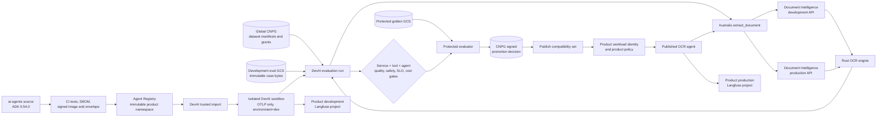

# Agent delivery lifecycle

## Outcome

The OCR service, Australis tool, OCR agent, DevAI evaluation configuration, and
product deployment are separate release units promoted as one tested
compatibility set. DevAI is where agents are authored, exercised, compared, and
approved. A product runtime consumes only a published signed version and keeps
its own identity, policy, secrets, and Langfuse project.

The first OCR agent targets Tesserix ADK 0.54.0. Consumer repositories may pin
it only after `tesserix/agent-development-kit#311` is reviewed and the immutable
`v0.54.0` release exists.

## End-to-end flow



The service endpoint authenticates the product workload and derives product,
tenant, region, quotas, retention, schemas, and provider policy server-side.
The request cannot supply those authorities. The shared OCR service receives no
product Langfuse credentials; agents and sandboxes emit OTLP to the platform
collector.

## Development and evaluation

1. `ai-agents` defines the agent, stable prompt prefix, tool schemas, policy,
   model settings, memory strategy, and hard budgets. The OCR result enters as
   ADK untrusted tool data and never as a system instruction.
2. CI uses only synthetic/public repository fixtures and no cloud or product
   credentials. Deterministic tests cover schema, required tools, forbidden
   actions, citations, prompt injection, cross-tenant access, retries, and
   cancellation.
3. A signed Registry envelope fixes the agent version, product namespace,
   runtime image digest, dependency lock, required scopes, and tool contract.
4. DevAI imports that verified envelope. The sandbox copies the signed namespace
   into `service.namespace`, forces `deployment.environment.name=dev`, removes
   direct Langfuse configuration, and exports OTLP only.
5. Global CNPG authorizes one frozen dataset version and budget. GCS serves the
   immutable bytes directly to the isolated runner through a short-lived,
   purpose-bound grant. DevAI never receives permanent corpus credentials.
6. Deterministic scorers run for every case. Calibrated model judges run on the
   approved sample; every failure and a random passing sample are eligible for
   human review. Langfuse shows safe trace metadata and scores but is not the
   authority for dataset or promotion state.

## Promotion contract

A promotion decision pins this complete tuple:

```text
service image + OCR model/profile + preprocessing + calibration
+ result schema + Australis tool + agent image + ADK release
+ prompt + model parameters + policies + retrieval/memory versions
+ dataset/labels + evaluator versions + runtime/hardware profile
```

The candidate advances through sandbox, offline evaluation, protected golden,
shadow, canary, and production. Missing evidence fails closed. Rollback moves
the compatibility alias to its signed predecessor; caches include the
compatibility digest, so a correctness-changing release cannot reuse an old
entry.

## Production feedback loop

Production traces contain opaque product/tenant/job/run IDs, component and model
versions, tool names/status, token usage, latency, cost, retries, warnings, and
evaluation scores. Raw documents, OCR text, extracted field values, signed
URLs, prompts containing document content, and credentials are prohibited.

Consented review outcomes and unusual/failing trace references may be nominated
as dataset candidates. Admission performs privacy classification,
de-identification where required, license/consent verification, human
adjudication, duplicate-family grouping, and split sealing. Nothing trains
directly from a production trace. Approved examples become new immutable
train/calibration/development-eval versions; the held-out golden corpus remains
unavailable to training and ordinary DevAI runs.

## Failure boundaries

| Failure | Required behavior |
| --- | --- |
| DevAI or evaluation unavailable | Production OCR and published agents continue; no candidate is promoted. |
| Langfuse unavailable | Runs continue with bounded telemetry buffering; CNPG retains evaluation and promotion truth. |
| CNPG unavailable | New dataset grants and promotion decisions stop; no state is invented in GCS, Qdrant, or Valkey. |
| Qdrant unavailable | OCR completes; semantic indexing queues and retrieval reports degraded status. |
| Valkey unavailable | Reads fall through and local conservative admission applies; accepted jobs are not lost. |
| Product dev route missing | Traces are dropped/buffered according to collector policy, never sent to production credentials. |
| Candidate fails a gate | It remains unpublished; the prior signed compatibility alias stays active. |

## Ownership

| Repository/system | Owns |
| --- | --- |
| `document-intelligence` | Rust OCR/API/workers, canonical evidence/results, service evaluations |
| `australis` | Narrow provider-neutral tool and agent grounding boundary |
| `ai-agents` | OCR agent, prompt, tool policy, ADK 0.54.0 runtime |
| `devai` | Sandbox execution, candidate/baseline comparison, trace review, promotion workflow |
| global CNPG | Dataset manifests, lineage, grants, budgets, run and signed decision metadata |
| GCS | Immutable corpus, scratch, result, golden, and model bytes in separate trust classes |
| Langfuse | Environment- and product-scoped non-authoritative observability |
