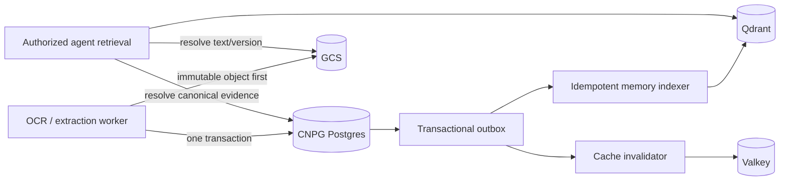

# Data architecture

## Ownership map

| Data | Authoritative store | Derived/cache store |
| --- | --- | --- |
| Tenant policy and quotas | CNPG Postgres | Valkey counters/cache |
| Upload, job, page and attempt state | CNPG Postgres | Valkey status cache |
| Idempotency and outbox | CNPG Postgres | none |
| Original document and page artefacts | GCS | none |
| Full normalized OCR result | GCS with digest/version in Postgres | bounded Valkey result metadata |
| Extracted fields, validation and review summary | CNPG Postgres | Valkey cache |
| Canonical chunks/memory and evidence | CNPG Postgres plus GCS text artefact | Qdrant embedding/index |
| Reviewer corrections | CNPG Postgres | Qdrant re-index after commit |
| Audit and deletion state | CNPG Postgres | none |
| Workflow history | qualified durable workflow engine | Postgres status projection |

## Write and index flow



Large object upload completes before the Postgres row references its digest and generation. A failed metadata transaction leaves an unreferenced object for a bounded sweeper; it never creates a result pointing at missing bytes. Postgres plus outbox is the only commit boundary for events, indexing intent and cache invalidation.

## Postgres schema groups

- `tenants`, `tenant_policies`, `retention_policies`;
- `uploads`, `documents`, `document_versions`, `pages`;
- `jobs`, `job_pages`, `attempts`, `idempotency_keys`;
- `result_versions`, `field_summaries`, `validation_findings`;
- `review_tasks`, `correction_versions`;
- `memory_records`, `chunks`, `embedding_intents`;
- `outbox_events`, `consumer_receipts`, `audit_events`, `deletion_operations`;
- `model_manifests`, `processing_profiles`, `calibration_versions`.

Every tenant-owned table has `tenant_id NOT NULL`, composite uniqueness that includes tenant identity where appropriate and row-level security as defense in depth. UUIDv7 identifies externally visible objects. Times are `timestamptz`; monetary cost is `numeric` or integer minor units; queryable lifecycle fields are columns rather than opaque JSONB.

Hot list indexes begin with tenant equality, then state/range and stable cursor ordering, for example `(tenant_id, created_at DESC, id DESC)`. Pending-work subsets use partial indexes. Exact indexes and pool sizes are accepted only after query plans and concurrency arithmetic exist.

## CNPG operations

- Three instances with topology spread and disruption budget.
- Primary writes; replicas serve only explicitly stale-tolerant reads after measurement.
- CNPG Pooler/PgBouncer transaction mode with total SQLx pool connections below database limits and administrative/migration headroom.
- WAL archive plus scheduled base backups to a separate GCS bucket using Workload Identity.
- Anti-affinity, storage alerts, replication-lag alerts and SLO-facing database availability alerts.
- Quarterly failover, PITR and full restore exercises; recorded recovery time is the evidence for RTO.
- GitOps owns Cluster, Pooler, backup, monitoring and migration configuration. No imperative production database changes.

## Qdrant semantic memory

Qdrant contains vectors, sparse/dense retrieval fields and bounded metadata—not raw documents, unrestricted OCR payloads or the only copy of a memory. The repository method requires a verified tenant scope, collection/model version and result limit; callers cannot pass arbitrary filters.

Indexing is asynchronous and idempotent. Read-your-own-write is not promised for semantic memory; the API exposes index status/lag. Agent answers resolve Qdrant hits back to the canonical Postgres/GCS version before citation, preventing stale or cross-tenant vector payloads from becoming evidence.

### Semantic-memory contract candidate

`ocr-domain` derives Qdrant-compatible UUIDv8 point identifiers from a
length-framed SHA-256 digest over tenant ID, canonical memory-record ID and
version, and embedding version. Exact at-least-once replay therefore produces
the same point ID; tenant, record-version or embedding-version changes produce
a different ID without hashing document text.

Collection aliases are constructed only from validated schema and embedding
major versions (`ocr-memory-s{schema}-e{embedding}`), not arbitrary request
strings. Query scope cannot be constructed without a validated tenant and a
limit from 1 through 100. Allowlisted point metadata contains only opaque
tenant, record, document, chunk, observation and version identifiers plus the
retention deadline. It excludes raw text, vectors, buckets, object names,
signed URLs and credentials. This contract does not select a client or approve
production indexing; those remain review items in issue #10.

Snapshots protect recovery time, but canonical records allow a full rebuild. Collection alias promotion supports zero-downtime embedding/model migrations and rollback.

## Valkey keys

Example namespaces:

```text
ocr:job:v1:{tenant_id}:{job_id}
ocr:result-meta:v1:{tenant_id}:{document_version}
ocr:admission:v1:{tenant_id}:{window}
ocr:model-manifest:v1:{model_digest}
```

Every key has a TTL. Active job cache entries are short lived; immutable terminal metadata may be longer. Hot-key refill uses single-flight. Rate-limit scripts set expiry atomically. Valkey loss never loses a job, event, correction or deletion request.

## Failure behavior

| Dependency | Behavior |
| --- | --- |
| CNPG primary unavailable | Writes fail fast; failover promotes a replica; workers retry before committing state |
| CNPG cluster unavailable | Create/read lifecycle endpoints are unavailable; accepted workflow work pauses safely |
| GCS unavailable | Document processing retries boundedly; metadata cannot claim a result whose object was not committed |
| Qdrant unavailable | OCR completes; index intents queue; semantic retrieval returns typed unavailable/degraded status |
| Valkey unavailable | Reads fall through to Postgres/GCS; conservative local admission limits replace distributed counters |

## Consistency and deletion

Job state, review corrections and deletion authorization are strongly consistent in Postgres. Cache state and vector indexing are eventually consistent and expose version/lag. An agent citation is valid only after resolving the canonical document and evidence version.

Deletion is a workflow across stores and is not reported complete until GCS, Qdrant and Valkey removal succeeds. Retried messages are safe because object generations and deterministic vector IDs make operations idempotent.
