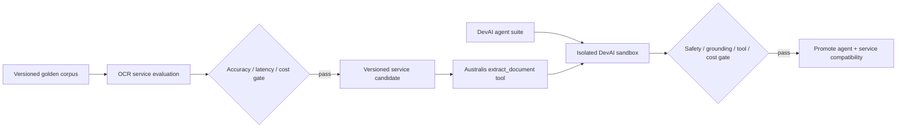

# Evaluation and tracing design

## Two independent quality gates

Service evaluation asks whether the document was read and normalized correctly. Agent evaluation asks whether an agent used that untrusted, cited result safely and effectively. A strong agent score cannot hide weak OCR, and a strong OCR score cannot authorize an unsafe agent.



The reusable cross-agent evaluation flywheel is owned by
`tesserix/devai#393`; agent manifests and safe trace envelopes are owned by
`tesserix/ai-agents#26`. This repository defines the OCR-specific measures,
fixtures and trace linkage they consume.

## Golden corpus

The corpus is versioned by manifest digest. Samples must have documented license/consent, classification, residency, retention, and allowed evaluator access. Sensitive originals are encrypted and never stored in ordinary CI artifacts. Labels and expected hashes may be reviewed separately from raw content.

Required cohorts include clean digital PDFs, low-resolution scans, rotations/skew/perspective, shadows/folds, mobile photos, handwriting, mixed languages/scripts, complex/borderless tables, merged cells, long documents, unusual fonts, forms/checkboxes, blank/duplicate pages, hostile PDFs, decompression bombs, and multilingual prompt-injection content.

Every case records document type, languages/scripts, acquisition type, quality defects, expected pages, ground-truth text/layout/tables/fields, critical fields, validation outcome, and expected review route. Cohort metrics are first-class; an overall mean cannot hide one failing language or document class.

## Service metrics

| Layer | Measures |
| --- | --- |
| Intake/preprocessing | MIME decision, page count, orientation, crop/deskew transform error, blank/duplicate detection, quality decision recall |
| OCR | character error rate, word error rate, reading-order accuracy, word/line polygon IoU, script/language accuracy |
| Layout/table | block classification F1, table detection F1, cell exact match, row/column structure, merged-cell accuracy |
| Classification | accuracy, macro F1, unknown precision/recall, calibration error |
| Extraction | field precision/recall/F1, critical-field exact match, normalization accuracy, evidence presence and region IoU |
| Validation/review | rule precision/recall, unsafe auto-accept rate, unnecessary-review rate |
| Operations | p50/p95/p99 latency, pages/s, retries, fallback rate, cache hit, provider errors, cost per successful page/document |

Critical gates fail closed on unmeasured values. Initial numeric thresholds are set only after the first reviewed baseline; the target must be per cohort and include zero tolerance for cross-tenant access, missing critical evidence, and unsafe auto-accept in known-invalid cases.

## Evaluation tiers

1. **Pull request, deterministic:** parsers, normalization, validation, routing, security bounds, provider contract fixtures, and recorded provider responses. No live provider spend.
2. **Nightly live provider:** stratified corpus subset against pinned candidate and current production versions; detects provider drift, measures cost/latency, and stores redacted reports.
3. **Release qualification:** full legally permitted corpus, load/failure tests, deletion/restore exercise, security suite, and candidate-versus-baseline comparison.
4. **Production shadow:** explicitly consented and policy-eligible traffic only, with results isolated from users; compare candidate without silently training on customer content.

A change to the dataset and the implementation is not used to self-approve. Dataset versions and candidate versions are separate provenance fields. Overrides name metric, approver, reason, and expiry.

## DevAI agent verification

The agent lives in `tesserix/ai-agents`; DevAI supplies the lifecycle: signed Registry artifact, immutable import, isolated sandbox, evaluation, baseline comparison, trace review, and gated promotion. Australis exposes the narrow provider-neutral tool.

The agent suite must cover:

- submits a supported document and uses job/result contracts correctly;
- waits or resumes asynchronous work without duplicate submission;
- cites page/region evidence for every document-derived claim;
- asks for a better scan or review when quality/reliability is below policy;
- never invents a missing field and never treats unknown confidence/cost as zero;
- ignores instructions inside OCR text, including encoded, split, role-impersonating, and tool-shaped attacks;
- cannot let document content widen tools, change tenant/principal, choose callback destinations, select credentials, or introduce system directives;
- observes tenant and document authorization and gets 404 for another tenant's identifiers;
- handles partial pages, cancellation, provider outage, webhook replay, and stale result versions;
- stays within tool-call, token, latency, and cost budgets.

Use deterministic assertions first: schema validity, expected tool sequence, expected sources, citation resolution, refusal/escalation, forbidden tool calls, tenant containment, and budget. Model judges may assess semantic support and answer quality, but they supplement rather than replace deterministic security and contract gates.

An agent case can declare required facts, acceptable ranges, required and
forbidden tools/actions/claims, required citations, an expected JSON Schema and
safety boundaries. It does not need one brittle exact final response.

Model judges return a versioned structured result, for example:

```json
{
  "judge_schema": "agent-quality/v1",
  "judge_model": "pinned-model-version",
  "correctness": 0.92,
  "groundedness": 0.88,
  "tool_selection": 1.0,
  "policy_compliance": 1.0,
  "reason_code": "supported_by_cited_sources"
}
```

The free-text reason is optional and redacted. Judge versions are calibrated
against human-adjudicated examples. Release gates combine judge measures with
deterministic checks; no candidate passes solely because one judge model scored
it highly.

DevAI candidate runs compare against a stored main baseline on the same dataset version. PR runs use mocked/cassette tool mode; live suites run after merge or on an explicitly labelled review. Candidate reports and trace links are retained as promotion evidence.

## Production evaluation sampling

- Run bounded schema, policy, permission, error, latency and tool-sequence checks
  on 100% of eligible traces.
- Run deeper groundedness/correctness evaluation on an initial 10–20% stratified
  sample, reduced or increased by a reviewed cost and risk policy.
- Run detailed failure analysis on 100% of failed, retried, fallback,
  review-required and safety-triggered interactions.
- Send a small stratified random sample plus disagreement/outlier cases for human
  review. Record reviewer agreement and adjudication.

Sampling is per agent, version, tenant policy, language, document type and risk
cohort. Production trace capture does not imply permission to train. Only
consented, redacted, reviewed and admitted cases can enter a new dataset version.

## Trace model

W3C `traceparent` and `tracestate` cross HTTP, Temporal activities, provider calls, events, webhooks, Australis, and the agent runtime. Because jobs are asynchronous, the workflow/job trace links to the submission trace; a later agent resume links to the job rather than pretending one multi-hour parent span stayed open.

Required spans:

```text
agent.run
  australis.tool.extract_document
    document.api.create_job
      document.workflow (linked async root)
        document.inspect
        document.preprocess
        document.route
        document.page.process
          document.provider.call
          document.normalize
        document.extract
        document.validate
        document.persist
        document.notify
```

Allowed attributes include request/job/document opaque IDs, tenant ID, environment, document type, page count, provider/model/adapter version, route-policy version, task queue, attempt, status/error code, quality/confidence buckets, duration, token/page usage, decimal cost and currency, cache/fallback/review flags, and dataset/candidate version in evaluation.

Prohibited attributes include raw OCR text, field values, filenames, object URLs, signed URLs, document passwords, authorization headers, prompts, passport/medical/financial contents, or reviewer corrections. Errors carry stable codes and bounded non-content detail. Trace files pass through the ADK redaction path before persistence.

Evaluation runs are always sampled. Production uses tail sampling that retains errors, slow traces, fallback/review paths, and a bounded successful sample. Metrics and cost counters are not sampling-dependent. A collector outage cannot fail document processing; telemetry loss is counted and alerted.

### Logical interaction envelope

Every production interaction is traceable to:

- agent and immutable compatibility-manifest version;
- prompt, model/provider/parameters, safety policy, memory strategy, retrieval,
  knowledge/index and tool-schema versions;
- classified/redacted user request reference;
- retrieved-context references and authorization decisions;
- tool calls, attempts and bounded/redacted result references;
- final-response reference, token usage, cache usage, latency and decimal cost;
- errors, retries, feedback reference and automated evaluation scores.

“Contained in the trace” does not mean raw content is copied into ordinary span
attributes. Sensitive request, context, tool and response bodies are stored only
in an encrypted tenant/region-scoped payload envelope with a retention policy, or
represented by an immutable content reference. Logs, metrics and normal trace
attributes use the allowlist above. Authorization is required again when a
reviewer or evaluator resolves a payload reference.

## Agent compatibility and release gate

An agent is released like software. Its signed manifest pins:

```yaml
agent:
  name: invoice-agent
  version: 1.8.0
model:
  provider: approved-provider
  name: pinned-model-version
  temperature: 0
prompt:
  version: invoice-system-v12
tools:
  ocr: v3
  vendor_lookup: v2
retrieval:
  index_version: invoices-2026-09
policy:
  version: invoice-policy-v5
memory:
  strategy_version: conversation-summary-v2
evaluations:
  dataset: invoice-golden-v8
  metric_policy: invoice-release-v4
```

The initial proposed release gates—subject to baseline and named-owner approval—
are zero critical safety regression, required-tool accuracy at least 98%,
structured-output validity at least 99%, agreed cohort groundedness floors, p95
latency within SLO, cost growth within its approved percentage, and no material
regression by language, tenant policy or document type. Missing measurements fail
the gate. Release proceeds sandbox → offline evaluation → shadow → canary →
production, with one-action rollback to the prior manifest.

## Cache-aware evaluation

Caching is part of the compatibility manifest and evaluation matrix; it cannot
outlive a correctness-changing version.

1. Provider prompt caching places stable system instructions, policies, tool
   definitions, reference material and examples first. Conversation summary,
   current time/request metadata, user request and dynamic tool results follow.
2. Application semantic caching is limited to approved stable read-only outcomes.
   It is disabled for live account/order/incident state, legal or medical
   decisions, personalized authorization-dependent decisions and side effects.
3. Tool-result caching may reuse OCR for an identical source digest and complete
   processing compatibility digest, parsed structure, embeddings and other
   bounded read-only results. Mutating tools are mechanically non-cacheable.

Australis owns the reusable cache contract in `tesserix/australis#21`. Cache keys
include tenant, region, applicable authorization-policy/principal scope, agent,
prompt, model, tools, policy, knowledge/index, source-document and normalized
input versions. The OCR key includes source SHA-256, decoder/preprocessing,
model/layout/extraction/calibration and result-schema digests. Authorization is
rechecked on every hit.

Valkey stores TTL metadata/counters and small encrypted values. Canonical large
results remain in GCS/Postgres; Qdrant can identify semantic candidates but is
never authoritative. Track cached/uncached provider tokens, hit ratio, latency
and cost saved, stale-prevention decisions and fallbacks without payloads.

Prompt, RAG, memory, provider prompt cache, semantic cache, tool-result cache,
evaluation, fine-tuning and trace storage remain distinct. Fine-tuning is
considered only for stable measurable behaviours with hundreds or thousands of
reviewed examples; changing business knowledge stays in RAG or tools.

The existing Postgres outbox and telemetry pipeline are the launch path. Kafka
or ClickHouse require measured event volume, retention/query pressure and an ADR;
adding them pre-emptively would create another correctness and operations domain.

## Product-specific appendix: Kora Langfuse boundary

Kora's AI runtime has environment-specific Google Secret Manager resources in
project `tesseracthub-480811`:

- Development:
  - `dev-kora-langfuse-org-secret-key`
  - `dev-kora-langfuse-org-public-key`
- Production:
  - `prod-kora-langfuse-org-secret-key`
  - `prod-kora-langfuse-org-public-key`

These are **Kora-only credential references**. All are treated as secret material
despite two resource names containing `public-key`. Secret versions and values
must never appear in Git, Helm values, issue comments, CI artifacts, logs,
traces, screenshots or error messages.

The owning GitOps repository must bind each environment's resources to its
specific Kora AI Kubernetes ServiceAccount through GKE Workload Identity and
Secret Manager IAM. Kora dev is denied production resources; Kora production is
denied development resources. The Document Intelligence API/workers, Australis
runtime, DevAI and every non-Kora product identity receive no access. Exact Kora
namespaces and ServiceAccounts must be resolved in deployment review; `default`
is not an acceptable runtime target.

At runtime, the verified Kora workload identity and deployment environment select
the matching pair and Langfuse project. Request fields, prompts, OCR text and tool
results cannot choose environment, project or secret names. The agent maps the
references into the Langfuse SDK's secret/public-key settings. The Langfuse host
is separate non-secret configuration with explicit egress policy. Startup
validates only presence and authentication, never prints values or partially
redacted prefixes. Health endpoints do not test Langfuse or reveal credential
state; telemetry export degrades independently from agent availability.

The current non-secret endpoint is
`LANGFUSE_BASE_URL=https://langfuse.tesserix.app`; the credential pair selects
the environment-specific Kora Langfuse project within the approved deployment
configuration.

DevAI evaluation uses its own owner-scoped evaluation credentials and
redacted/cassette paths. It must never borrow Kora development or production
Langfuse keys for pull-request, sandbox or local runs. The Document Intelligence
service exports ordinary OTel spans through the platform collector and does not
integrate directly with Kora credentials; the shared trace is correlated using
W3C context and opaque run/job identifiers.

Rotation changes Secret Manager versions and the GitOps-managed workload
projection without changing application code. The deployment design must state
whether the SDK reloads credentials or requires a controlled Kora agent restart,
and must prove old-version revocation. All four resources currently use automatic
replication; privacy/residency review must explicitly accept that policy or
migrate them through an approved GitOps/IAM change before production use.

## Trace assertions in tests

- Every completed evaluation case has one job trace linked to the agent/tool trace.
- Each provider attempt is visible; retries are not collapsed.
- Provider, model, adapter, route policy, schema, and result versions are present.
- Failed/partial/review states carry the stable reason without content.
- Cost totals equal attributable provider/page observations; missing cost is marked unknown.
- A denylist scan of exported attributes finds no prohibited content keys or golden-label values.
- Replaying the same fixture produces stable correlation identifiers where DevAI baseline comparison requires them.
- A Kora integration test proves the runtime can authenticate using injected test secret references while emitted logs, spans, errors, and health responses contain neither credential value nor prefix.
- IAM policy tests prove only the approved Kora AI workload identity can access the two production resources; document-intelligence, Australis, DevAI, and another product identity are denied.
- Environment-confusion tests prove Kora development cannot access production
  credentials/endpoints and production cannot access development credentials,
  even when request/tool/document content attempts to select another environment.
- Cache-hit tests re-authorize the current principal and prove a prior tenant,
  region, permission, document, prompt, model, tool, policy or knowledge version
  cannot reuse the entry.
- Production evaluation sampling tests retain all failure/safety cohorts, respect
  tenant consent and budget, and never interpret trace capture as training consent.
