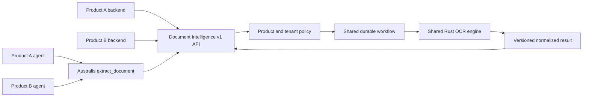
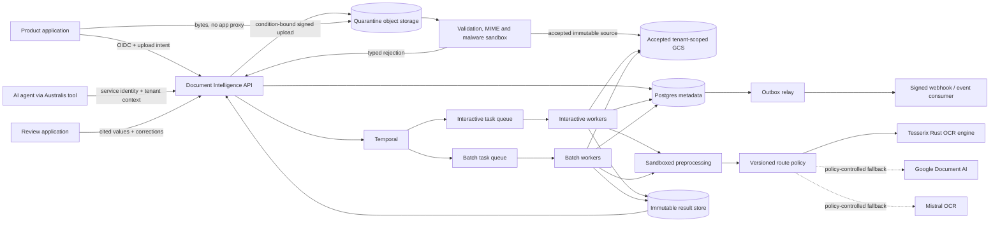
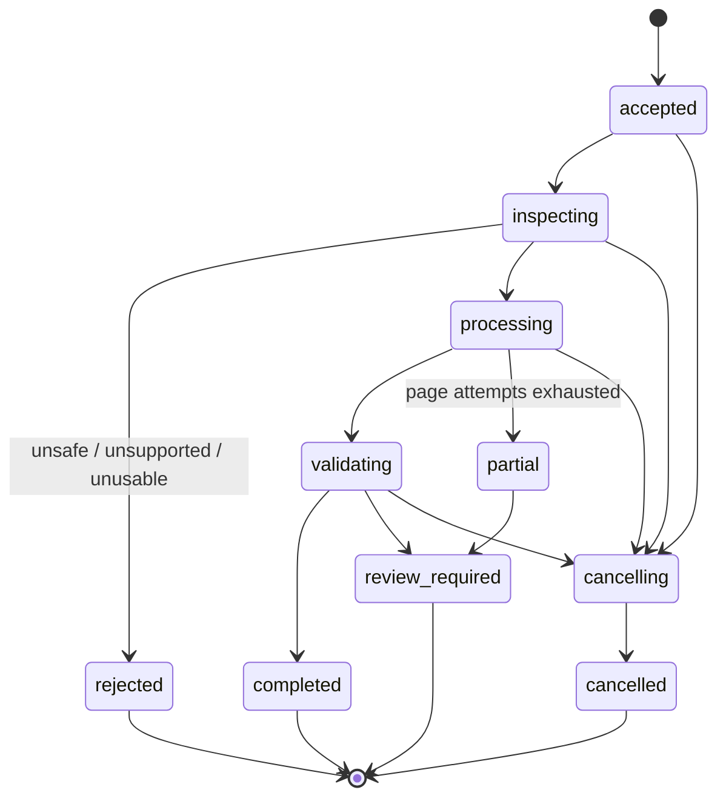

# High-level design

## Decision summary

Build a Rust service with separately scalable API and engine workers, CloudNativePG Postgres for authoritative metadata, GCS for immutable inputs/results, Qdrant for rebuildable semantic memory, Valkey for disposable caching/admission control, and a qualified durable workflow runtime. Start in one approved GCP region on the shared GKE platform. Tesserix's evidence-first Rust OCR engine is the primary Phase 1 implementation; cloud OCR remains a benchmark or policy-controlled fallback rather than the canonical runtime.

The boundary is justified by a distinct scaling profile (CPU-heavy page work and provider latency), failure domain (hostile documents and provider outages), and data ownership (document lifecycle, result provenance, retention, and deletion).

## Reusable consumer boundary

Document Intelligence is one independently deployable shared service, not a
library embedded into each product and not a Kora subsystem.

| Consumer | Integration | Receives |
| --- | --- | --- |
| Product backend | Versioned HTTPS API through generated typed client | Job/status/result/review contracts scoped to verified product and tenant |
| AI agent | Australis `extract_document` tool backed by the same API | Untrusted normalized result, evidence and async resume contract |
| Batch/import workload | Approved connector plus job API | Idempotent batch jobs and page/result events |
| Review application | Review API with object-level authorization | Bounded source regions, proposed values and correction contract |

Generated clients contain transport types, authentication hooks and retry rules;
they do not contain OCR inference, product policy or credentials. Products cannot
select internal queues, storage paths, provider credentials or another tenant.
The API derives product/tenant identity from OIDC/workload identity and applies
registered policy, quotas, residency and schemas server-side.

The canonical API/result/event contracts and model compatibility manifest are
product-neutral. Product-specific prompts, agents, review UX, document retention,
Langfuse projects and business validation extensions remain in their owning
repositories/configuration. Onboarding a product adds identity/policy/schema and
contract tests; it does not fork the service or engine.

## Context

## Runtime units

| Unit | Responsibility | Scaling signal |
| --- | --- | --- |
| `document-api` | Authentication, object authorization, upload intents, job creation/read/cancel, result locators | request rate and in-flight requests; minimum 2 replicas |
| `document-worker-interactive` | Small, latency-sensitive workflows | Temporal task-queue backlog/age |
| `document-worker-batch` | Large documents and batches | task-queue backlog/age and page concurrency |
| `document-worker-provider-*` | Provider calls with provider-specific concurrency/circuit policy | queue age, provider quota, in-flight calls |
| `document-outbox-relay` | Durable webhook and domain-event delivery | unpublished outbox rows/oldest age |
| parser/preprocessor sandbox | MIME inspection, malware scan, PDF render and image transforms | invoked with strict CPU/memory/time/output bounds |

All runtime images are multi-stage, digest-pinned, non-root, read-only, without static cloud keys. GKE Workload Identity grants each unit only its required buckets, database identity, KMS keys, or provider API. Network egress is allowlisted.

## Data ownership

CloudNativePG Postgres owns jobs, pages, attempts, provider decisions, extraction/validation summaries, canonical memory/chunks, idempotency records, review tasks, corrections, retention state, and outbox/audit events. Every tenant-owned table has `tenant_id`; repository queries require the verified tenant and use row-level security as defense in depth.

GCS owns immutable source versions, rendered/preprocessed page artifacts where retention permits, full normalized results, and encrypted golden-set assets. Object names use generated identifiers, never user filenames or PII. Buckets and keys are regional and environment-separated. The internal result locator is tenant-bound and generation-pinned; any externally issued signed URL is short-lived.

Temporal owns execution history, timers, retries, and signals; it does not replace Postgres as the query/API source of truth. Status projection writes are idempotent. Large binary content and normalized page payloads are never placed in workflow history; activities pass content-addressed locators.

Qdrant owns only derived vector/sparse indexes for semantic memory. Every hit resolves back to its canonical Postgres/GCS document version before citation. Valkey owns only TTL-bound cache entries and atomic admission counters; cache failure falls through to the authoritative stores.

## Job lifecycle

Terminal states are explicit. A job can be `completed` with non-critical warnings; it cannot be completed when a required critical field lacks evidence or a required validator failed.

## Durable workflow

1. The API authenticates the principal, derives `tenant_id`, validates bounded metadata, and resolves only a tenant-scoped upload/object reference.
2. One Postgres transaction claims the idempotency key, writes the `accepted` job, and writes a `job.accepted` outbox event. The response is returned only after commit.
3. The relay starts Temporal workflow `ocr-job-{job_id}`. Duplicate starts collapse on workflow ID. A crash after database commit is recovered by the outbox relay.
4. Inspect activities sniff MIME, scan malware, hash content, enforce bounds, decrypt any one-time PDF secret, render pages, and record source version. The password token is consumed and its ciphertext scheduled for deletion.
5. Preprocessing emits a transform manifest and quality scores; original bytes remain immutable. `input_unusable` stops before paid OCR.
6. Classification and route policy choose a versioned processing profile. The policy records its inputs and decision without recording document text.
7. Page activities run with a bounded concurrency group. Each page has its own idempotent attempt key and immutable artifact locator. A failed page retries independently.
8. Normalization maps provider observations into the canonical versioned model. Extraction and deterministic validation run as distinct activities.
9. Results commit to GCS; one Postgres transaction updates terminal status, summaries, result digest/locator, audit record, and outbox events.
10. Webhook delivery is at least once. Signature, timestamp, event ID, retry cap, and consumer deduplication make replay safe.

Documents over 25 pages use child workflows per bounded page group so one 300-page input does not produce unbounded history. Workflow code is versioned; activities carry start-to-close and heartbeat timeouts. Retryable failures are timeouts, connection resets, `429`, and `5xx`; validation, unsupported input, `400`, `409`, and `422` are non-retryable. Exhausted pages produce `partial` plus review routing rather than re-running successful pages.

## API shape

The edge is `/v1`. Identity and tenant are derived from the verified access token or workload identity, never request JSON.

| Method | Path | Contract |
| --- | --- | --- |
| `POST` | `/v1/ocr/uploads` | Create a tenant-scoped, size-limited upload intent |
| `POST` | `/v1/ocr/secrets` | Create a one-time encrypted PDF-password token |
| `POST` | `/v1/ocr/jobs` | Create one job with required `Idempotency-Key` |
| `GET` | `/v1/ocr/jobs/{job_id}` | Read tenant-scoped status; cross-tenant and missing both return 404 |
| `POST` | `/v1/ocr/jobs/{job_id}/cancel` | Idempotently request cancellation |
| `GET` | `/v1/ocr/jobs/{job_id}/result` | Return metadata plus short-lived result locator or bounded inline result |
| `GET` | `/v1/ocr/jobs` | Cursor-paginated tenant job list with a server maximum |
| `POST` | `/v1/ocr/reviews/{review_id}/corrections` | Record an authorized correction with source and actor provenance |

`POST /jobs` always creates a durable job. A caller may send `Prefer: wait=10`; if terminal within the bounded wait the service returns the result, otherwise `202` with the same job. There is no separate synchronous pipeline.

Every error has `code`, `message`, and `request_id`. State-changing endpoints define idempotency. Dates are UTC RFC 3339. Prices/costs use decimal strings with currency. Arbitrary remote URLs are refused; service-issued uploads and approved storage connectors avoid an SSRF service disguised as OCR.

## Canonical result

The full result is versioned independently from the API and contains:

- immutable `document_id`, `document_version`, source digest, schema version, and `content_trust: untrusted`;
- pages with dimensions, detected scripts/languages, quality, reading-order blocks, lines, words, tables/cells, selection marks, and normalized polygons;
- normalized text and optional Markdown, explicitly marked as derived content;
- classification candidates and confidence;
- schema version/digest, extracted fields, normalized values, field confidence, and evidence references;
- deterministic validation findings with stable codes and severity;
- separate quality/OCR/classification/extraction/validation/overall reliability values plus calibration version;
- provider route, adapter/model versions, preprocessing profile, transform manifest, timing, usage, and decimal cost;
- warnings, partial-page status, and review decision.

Coordinates are normalized to `[0,1]` against the original page. Evidence also retains the transform manifest so a reviewer highlight maps correctly after crop, rotation, deskew, or perspective correction. A confidence number without its calibration cohort/version is not used as a universal probability.

## Provider routing and degradation

Phase 1 selects only a signed Tesserix engine model/profile and does not invent a generic provider plugin framework. Established open-source and cloud OCR services are benchmark competitors, not runtime dependencies. External provider adapters are introduced only when measured cohort gaps justify a policy-controlled fallback. At that point, a versioned deterministic policy considers tenant allowlist, residency, document class, language/script, handwriting, layout needs, page count, latency class, health, quota, benchmark cohort and budget.

Fallback occurs only when policy permits and a declared trigger fires: unsupported capability, retry exhaustion, low calibrated confidence on critical fields, or deterministic validation failure. Both attempts and disagreement are preserved. A vision LLM interprets bounded cited regions only; it never receives the whole document by default.

| Dependency unavailable | Behaviour |
| --- | --- |
| Postgres | create/read API fails fast; workers pause before state changes; no acknowledged job is lost |
| GCS | upload/result access fails fast; workflow retries boundedly without losing metadata |
| Temporal | accepted jobs remain in Postgres/outbox and start after recovery; reads/cancels remain available as projected state |
| Rust OCR engine or allocated device | page activity retries on a healthy worker/device; circuit and queue backpressure isolate the failing profile; exhausted pages become partial/review-required |
| Optional cloud OCR fallback | primary Rust processing continues; only policy-eligible fallback jobs lose the optional route |
| malware scanner/parser sandbox | intake fails closed; no provider call occurs |
| webhook destination | job remains complete; delivery retries independently then dead-letters and alerts |
| telemetry collector | processing continues; bounded local buffering/drop counters expose loss; raw content is never added as fallback logs |
| review application | `review_required` remains queryable; OCR processing and completed-result reads continue |

## Isolation and backpressure

- Per-tenant admission rate, queued pages, concurrent pages, daily pages, and spend budgets.
- Separate Temporal task queues and worker deployments for interactive, priority, batch, and provider calls.
- Weighted fairness prevents a large tenant from consuming every worker.
- Provider concurrency stays below regional quota with headroom; a circuit breaker and retry budget prevent retry storms.
- API request bodies are small metadata. Binary upload goes directly to a tenant-scoped object using a short-lived condition-bound URL.

## Delivery, recovery, and cost

GitOps owns deployment. Phase 1 is single-region, multi-zone with at least two API replicas, topology spread, PDB, startup/readiness/liveness probes, queue-based autoscaling, and graceful worker drain. Progressive rollout uses worker versioning and canary API deployment. Rollback is the prior image/config revision; running Temporal workflows remain compatible through workflow versioning.

CloudNativePG replication, WAL archiving and tested point-in-time recovery target
RPO 5 minutes/RTO 60 minutes. GCS object versioning/retention follows tenant
policy. Restore and deletion verification are release gates.

Before procurement, measure provider prices against the golden corpus. Initial planning envelope is provider cost per page plus shared-platform incremental compute/storage; fixed new infrastructure should be avoided where the existing GKE, Postgres, object storage, Temporal, and observability platforms meet isolation requirements. A production proposal must include measured cost per successful page/document and p95 cost by cohort—unknown cost is not recorded as zero.

## Simplest rejected alternative

Calling Google Document AI directly from each product is initially smaller, but it duplicates hostile-file handling, tenant policy, evidence, retention, retries, evaluation, and audit while coupling every agent to provider schemas. The repeated security and correctness boundary justifies this service.
