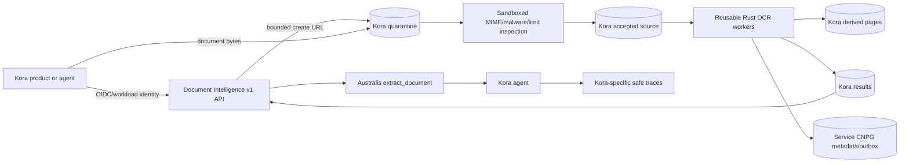

# Kora runtime storage integration

## Scope

Kora is one consumer of the reusable Document Intelligence service. This design
owns only Kora's production document storage and integration boundary. Shared
OCR models, sandbox, training/calibration, development evaluation, held-out
golden evaluation and candidate models are product-neutral and defined in
`SANDBOX-EVALUATION-TRAINING.md`.

Kora applications and agents use authenticated `/v1` service endpoints or the
provider-neutral Australis `extract_document` tool. They do not import OCR engine
internals or receive direct GCS, CNPG, Qdrant or Valkey credentials.

## Product and environment identity

The Kora integration is selected from verified runtime identity, never caller
JSON, prompt text, OCR content or tool output. The gateway validates token
signature, issuer, audience, expiry and expected algorithm, then maps the
principal to a server-owned `product_id=kora`, environment, tenant scope and
policy. The shared service uses that context for authorization, quota, residency,
storage routing and audit; it does not accept a request-controlled product ID.

Kora dev and production use distinct Kubernetes ServiceAccounts, GCP Workload
Identity principals, configuration and Secret Manager resources:

| Runtime identity | OCR endpoint/policy | Langfuse credentials |
| --- | --- | --- |
| Kora development | Non-production Document Intelligence endpoint and Kora dev policy | `dev-kora-langfuse-org-secret-key` and `dev-kora-langfuse-org-public-key` |
| Kora production | Production Document Intelligence endpoint and Kora production policy | `prod-kora-langfuse-org-secret-key` and `prod-kora-langfuse-org-public-key` |

Environment selection occurs at deployment/configuration time and is checked
against workload identity. A dev request cannot ask for production routing, and
a production request cannot downgrade into dev storage or evaluation. The shared
Document Intelligence service and its evaluation/training identities have no
access to any of these product-specific Langfuse credentials.

## Product-specific storage boundary

Use Kora buckets separated by runtime data class, not one bucket per document:

| Logical bucket | Purpose | Initial lifecycle | Recovery class |
| --- | --- | --- | --- |
| `prod-kora-ocr-quarantine` | Untrusted direct uploads before validation | Reject/incomplete expiry after 24 hours; delete accepted generation after verified promotion | Re-upload required |
| `prod-kora-ocr-source` | Accepted immutable originals | Tenant policy, initially 30 days | Authoritative until retention/deletion completes |
| `prod-kora-ocr-derived` | Rendered and preprocessed pages | Delete after 48 hours unless an active job/review lease exists | Rebuild from accepted source and profile |
| `prod-kora-ocr-results` | Normalized result artefacts and evidence maps | Tenant policy, initially 30 days | Authoritative retained result artefact |

Physical names, owning project and region remain GitOps review decisions in
`tesserix/tesserix-k8s#914`. All buckets use uniform bucket-level access,
public-access prevention, Workload Identity, encryption, access logs and bounded
lifecycle/versioning. Retention locks are enabled only when legal policy requires
them because they prevent early erasure.

Object names contain no filename or business/identity data:

```text
tenants/{tenant_id}/documents/{document_id}/versions/{source_digest}/original
tenants/{tenant_id}/documents/{document_id}/versions/{source_digest}/pages/{page_id}/{profile_digest}
tenants/{tenant_id}/documents/{document_id}/results/{result_version}/document.json.zst
```

The path tenant is routing metadata, not authorization. The API derives tenant
and product from verified identity and scopes every metadata/object lookup.
Cross-tenant, cross-product and missing identifiers return the same not-found
outcome.

## Workload access matrix

| Workload | Quarantine | Source | Derived | Results |
| --- | --- | --- | --- | --- |
| Upload signer | create-only signed intent | none | none | none |
| Scanner/importer | exact-generation read/delete | create with preconditions | none | none |
| OCR worker | none | authorized read | read/write | write |
| Result API | metadata/bounded sign | bounded sign | bounded sign | bounded sign/read |
| Review service | none | bounded page through API | bounded tile through API | authorized API read |
| Lifecycle controller | delete | delete | delete | delete |
| Kora application/agent | none | none | none | service API/tool only |
| Shared trainer/evaluator | none | none | none | none |

Separate GCP service accounts bind to dedicated Kubernetes ServiceAccounts with
Workload Identity. No service receives `storage.admin` or a service-account key.
Upload URLs expire within 15 minutes and are method, object, size and content-type
bound. Result URLs expire within five minutes by default. Exact lifetimes are
server policy, not caller input.

## Connected reusable-service flow



The same API, result, evidence and event contracts serve other products with
their own authorized storage policy. Product names do not appear in the OCR
engine, canonical result schema, route policy, model manifest or shared dataset
identities.

## Upload-to-result workflow

1. Kora requests an upload intent. The API derives tenant/product identity and
   reserves an opaque document version in CNPG.
2. GCS receives bytes directly. A notification plus reconciler handles missed or
   duplicate delivery using exact bucket/object/generation identifiers.
3. The scanner sniffs MIME, scans malware and enforces byte, pixel, page,
   decompression and parser-time bounds in a sandbox.
4. Acceptance copies to source with generation-match and destination-absent
   preconditions. One CNPG transaction records digest/generation, job and outbox
   event before quarantine cleanup.
5. The durable workflow preprocesses and processes bounded page groups. Page
   retries address failed pages only and write content-addressed artefacts.
6. The immutable result is written before CNPG atomically records its generation,
   digest, summaries, terminal state, audit and outbox intents.
7. Outbox consumers invalidate Valkey, update Qdrant from canonical records and
   deliver signed events. Their failure cannot roll back a completed OCR result.
8. Kora reads through the API/tool. Document content is marked untrusted and
   claims require evidence IDs resolvable to authorized page regions.

## Product trace boundary

Kora agents may export safe trace/experiment metadata to the Kora Langfuse
project using credentials for their own environment. Development uses only the
two `dev-kora-*` resources; production uses only the two `prod-kora-*` resources.
Those credentials are unavailable to Document Intelligence workers, shared
evaluation/training, DevAI, Australis or another product.

The shared trace is correlated using W3C context and opaque agent/tool/job IDs.
Ordinary attributes exclude OCR text, prompts, filenames, field values, signed
URLs and sensitive document contents. If Kora policy retains content for review,
it uses a separately authorized encrypted payload reference with Kora retention;
that does not admit the content to a shared training dataset.

## Deletion and failure behaviour

Deletion is idempotent and tracked in CNPG. It revokes new URL issuance, cancels
active work, deletes exact GCS generations, removes deterministic Qdrant points,
invalidates Valkey and records acknowledgements. The operation remains
`deletion_pending` until every required store confirms removal or reports the
applicable backup/retention expiry.

- Quarantine outage blocks new Kora uploads but not existing result reads.
- Source/results outage pauses affected work; CNPG cannot mark a missing object complete.
- Qdrant outage delays indexing and degrades retrieval; OCR truth remains intact.
- Valkey outage falls through to canonical stores with conservative admission.
- Kora Langfuse outage cannot fail OCR or agent availability; telemetry loss is bounded and measured.
- Shared training/evaluation outage has no effect on Kora production processing.

## Review gates

- Approve physical bucket names, project, region, lifecycle, versioning and CMEK.
- Approve workload identities and prove Kora/other-product/shared-evaluator denies.
- Approve tenant/product authentication and 404 cross-boundary contract tests.
- Exercise upload reconciliation, orphan cleanup, deletion, legal hold and restore.
- Verify reusable endpoint/tool compatibility with Kora and at least one second product.
- Approve cost, SLO, alerts, runbooks, GitOps rollout and one-action rollback.
