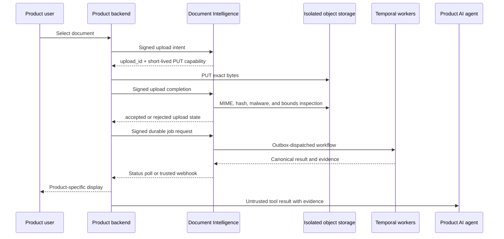

# Product integration guide

This guide is for a product team integrating its backend with the shared
Document Intelligence API. It applies to every product; Kora is only one
consumer. The editable architecture diagram is
[product-ocr-integration.drawio](product-ocr-integration.drawio).

The product owns user authentication, authorisation, tenant selection, user
experience, retention policy, and any decision made from extracted data.
Document Intelligence owns bounded document ingestion, OCR execution,
provider routing, evidence, durable status, and the canonical result.

## Integration boundary

Only a product's server-side adapter calls Document Intelligence. A browser,
mobile client, MCP client, or agent never receives an OCR signing key, an
object-storage location, or a signed upload URL.

Before calling OCR, the product adapter must:

1. Authenticate the product user.
2. Authorise that user to upload or read this document.
3. Derive an opaque tenant scope from the verified product session.
4. Select the product-specific OCR endpoint and credential for the current
   environment.
5. Create an idempotency key for each logical upload and extraction request.

The OCR service verifies the signed workload envelope and derives product and
tenant scope from it. It never trusts product, tenant, provider, bucket, role,
or retention values supplied in JSON.

## Lifecycle



The first API response is not OCR text. It is an upload capability with a
short expiry. The product must PUT exactly the original bytes with only the
headers returned by the service. It must not construct a storage path, modify
the URL, or reuse the capability for another file.

## Minimal backend flow

1. Calculate the SHA-256 of the uploaded bytes while applying the product's
   own request limits.
2. `POST /v1/ocr/uploads` with `content_type`, `content_length`, and
   `sha256:<lowercase hex>` plus a fresh `Idempotency-Key`.
3. PUT the original bytes to the returned `upload_url` and exact
   `required_headers`.
4. `POST /v1/ocr/uploads/{upload_id}/complete`.
5. Poll `GET /v1/ocr/uploads/{upload_id}` until `accepted` or `rejected`.
6. If accepted, `POST /v1/ocr/jobs` with the `upload_id`, required output
   sections, optional language hints, and a fresh idempotency key.
7. Poll `GET /v1/ocr/jobs/{job_id}` or receive a product-configured webhook.
8. Fetch `/v1/ocr/jobs/{job_id}/result` only for `completed`, `partial`, or
   `review_required` jobs.

The product may offer a short synchronous wait for a small document, but it
must persist the job ID and resume asynchronously. A timeout, page failure, or
browser reload is not permission to start a second logical job.

## Signed adapter request

For every non-health endpoint, the product adapter creates an HMAC-SHA256 over
five newline-separated values:

```text
key_id
derived_tenant_id
unix_timestamp
HTTP_METHOD
path_and_query
```

It sends the result as `X-OCR-Signature` with `X-OCR-Key-Id`,
`X-OCR-Tenant-Id`, and `X-OCR-Timestamp`. The credential is stored and
rotated through the product's server-side secret path. Do not use it in a
frontend bundle, analytics event, log line, or agent prompt.

Use the API's stable error `code`, not its human-readable `message`, for
product branching. A `401` means the adapter must fail closed; `404` hides
both missing and out-of-scope documents; `409` means retry only with the same
logical idempotency key where the contract permits it.

## Supplying OCR to an AI agent

The product backend exposes a narrow tool such as `extract_document` to its
agent. The tool, not the agent, owns authorisation, signing, polling,
redaction, and audit logging.

```json
{
  "document_ref": "product-owned opaque reference",
  "document_type": "auto",
  "include_evidence": true
}
```

The tool response contains the canonical result, confidence, warnings,
validation state, and page/polygon citations. Set `content_trust` to
`untrusted` in the product's agent runtime. OCR text, including text that asks
the agent to ignore instructions or send data elsewhere, is data to analyse;
it must never become system instructions. The agent should cite evidence and
escalate low-confidence or `review_required` results to a product review UI.

## Environment and release policy

| Environment | Product adapter target | Documents | Credentials | Promotion |
| --- | --- | --- | --- | --- |
| Sandbox | Sandbox OCR services | Isolated test bucket; 24-hour retention | Product development credential only | Test and evaluate here |
| Production | Production OCR services | Product-isolated production buckets | Product production credential only | Immutable Kargo Freight through Argo CD |

Never let a sandbox adapter call production OCR with a development credential,
or use a production trace credential for sandbox evaluation. Product-specific
Langfuse credentials belong to the product's agent runtime, not to the shared
OCR service.

## Product checklist

- [ ] Backend adapter authenticates the user and performs per-document
      authorisation before every read and write.
- [ ] Tenant scope is derived server-side and never taken from a client body.
- [ ] Upload size, page count, MIME, and timeout limits are enforced at the
      product edge as well as by OCR.
- [ ] Idempotency keys are retained with the product request record.
- [ ] Browser uploads use the returned one-time capability only.
- [ ] Product logs contain correlation IDs and state transitions, never OCR
      content, credentials, signed URLs, or storage object locations.
- [ ] Agent tools receive untrusted OCR data plus evidence, not direct keys.
- [ ] Low-confidence, validation-failed, partial, and review-required results
      have a human-review or explicit product-error path.
- [ ] Sandbox and production credentials, storage, traces, and retention are
      separate.

## References

- [OCR API usage guide](OCR-API-USAGE.md)
- [OpenAPI v1 contract](../../contracts/v1/openapi.json)
- [Signed workload identity envelope ADR](../adr/0009-signed-workload-identity-envelope.md)
- [Untrusted content and evidence ADR](../adr/0003-untrusted-content-and-evidence.md)
