# Rust OCR engine design

## Product thesis

Build the best evidence-first OCR engine for AI agents and document workflows, not the broadest demo. Every recognized token must be traceable to an immutable source region, carry calibrated uncertainty and remain explicitly untrusted when consumed by an agent.

The initial design point remains 20 submitted jobs/s and 100 pages/s peak, with typical four-page documents, a 300-page/100 MiB hard ceiling and page streaming for long inputs. The API p99 target is under 300 ms; eligible two-page interactive processing targets p95 under 10 seconds after benchmark calibration.

## Engine pipeline

```mermaid
flowchart LR
    Input[Immutable page] --> Decode[Bounded decode]
    Decode --> Quality[Quality vector]
    Quality --> Geometry[Rotate, crop, deskew, dewarp]
    Geometry --> Detect[Text-region detector]
    Detect --> Orient[Region orientation]
    Orient --> Recognize[Text recognizer]
    Recognize --> Layout[Layout and reading order]
    Layout --> Calibrate[Confidence calibration]
    Calibrate --> Evidence[Observation graph and evidence]
    Evidence --> Validate[Deterministic validation]
    Validate --> Output[Page stream / result / review]
    Calibrate -->|bounded low-confidence region| Vision[Optional vision interpretation]
    Vision --> Evidence
```

Each stage consumes and produces typed, versioned artefacts. The original page is immutable. Geometry operations append an invertible transform so every derived polygon maps back to the original page.

## Cargo workspace

| Crate | Responsibility |
| --- | --- |
| `ocr-domain` | Newtyped IDs, page geometry, observations, confidence, language/script, errors and version contracts |
| `ocr-image` | Bounded decode, quality vector, rotation, crop, deskew, dewarp, denoise and transform graph |
| `ocr-detect` | Detector model contract, tiled inference, polygon post-processing and region filtering |
| `ocr-recognize` | Orientation, script/language routing, recognition batching and token/character alternatives |
| `ocr-layout` | Reading order, blocks, headings, lists, tables, cells, selection marks and page sections |
| `ocr-runtime` | Signed model loading, warmed sessions, device pools, shape buckets, pixel budgets and streaming execution |
| `ocr-eval` | Golden manifests, CER/WER, geometry/table/layout metrics, calibration and benchmark reports |
| `document-service` | Axum API, authentication, tenancy, SQLx metadata/outbox, workflow integration and OTel |

Crates use Rust stable edition 2021, Tokio for I/O, Axum/Tower for HTTP, SQLx for Postgres, serde for edges, thiserror for typed failures and tracing/OTel for telemetry. CPU inference and preprocessing never block Tokio executor threads.

## Model contract

Every deployed model artefact has a signed manifest containing:

- model family, semantic version and immutable digest;
- stage and compatible input/output schema versions;
- supported scripts/languages, image shapes and precision;
- training/evaluation dataset provenance permitted for release;
- license and redistribution obligations;
- runtime and execution-provider compatibility;
- calibration version and approved cohorts;
- measured accuracy, latency, memory and cost envelope;
- rollback predecessor.

The runtime refuses unsigned, incompatible or unapproved artefacts. Model outputs are untrusted numeric tensors until stage-specific validation establishes shape, bounds and finite values.

## Inference runtime

Initial inference uses ONNX Runtime through a pinned Rust binding. CPU, CUDA and TensorRT execution profiles are separate release artefacts because numeric precision and operator support can change results.

Performance comes from:

- one warmed session pool per device, model and version;
- bounded dynamic batches grouped by image-width and shape bucket;
- pixel-budget admission rather than file-count admission;
- detector tiling only above a measured resolution threshold;
- recognition batching across compatible regions and pages;
- reusable aligned image and tensor buffers with explicit memory ceilings;
- page-level pipeline overlap and streaming results;
- content, model and profile-addressed caching with tenant scope;
- optional quantization and distillation only after cohort regression checks.

No request may select an arbitrary model path, operator library, device, YAML or execution-provider option.

## First model profile

The first production profile is intentionally narrow:

- printed English text;
- clean scans and mobile photographs;
- PNG, JPEG and WebP plus rendered PDF pages;
- text regions, line and word text, confidence, original-page polygons and reading order;
- CPU baseline and one approved NVIDIA GPU profile.

Tables, handwriting, mixed scripts, formulas and complex layouts are added as separately evaluated profiles. Hindi and other Indian scripts, Australian invoices and receipts, and product-specific forms are strong candidate cohorts, but their priority requires real tenant samples and approved labels.

## Confidence and evidence

Detector, recognizer, layout and quality scores remain separate. Calibration is measured per model version, script, document class, acquisition type and quality band. Unknown calibration is not zero and cannot auto-accept a critical field.

The observation graph stores token, line and block relationships, alternatives where useful, original and derived polygons, transform chain, reading-order edges, model/profile versions and calibration cohort. Downstream extraction cites observation IDs rather than copying unverifiable text.

## Safety and failure isolation

Rust reduces memory-safety risk in owned code but does not make PDF codecs, image libraries, GPU drivers or ONNX Runtime safe. Decode and inference workers are disposable sandboxes with no network, no shell, read-only root filesystem, generated work paths, strict input, output, time, CPU and memory limits, and narrow object access.

NaN and infinite tensors, impossible coordinates, invalid UTF-8, output explosions, model mismatch and GPU faults are typed failures. A page failure cannot terminate the API or restart successful pages. Raw document text never enters logs or trace attributes.

## AI-assisted capability

AI helps in four controlled places:

1. label assistance with human approval for golden datasets;
2. hard-example mining from consented, reviewed corrections;
3. training, distillation and calibration experiments;
4. bounded interpretation of low-confidence regions with page evidence.

An AI result cannot overwrite deterministic OCR evidence. It is an additional observation with its own model version, confidence, cost and provenance. Agent reasoning remains outside the OCR engine.

## Benchmark and promotion

Established open-source OCR implementations, cloud OCR providers and relevant open models are benchmark competitors, not runtime dependencies. Every candidate runs on identical images, hardware and cohorts.

Promotion requires no regression beyond approved tolerance in CER, WER, evidence IoU, reading order, tables and layout, critical-field exact match, unsafe auto-accept, p95 and p99 latency, peak memory and cost per successful page. Reports include cold and warm runs and never combine unknown cost with zero.

## Delivery slices

1. `ocr-domain` plus golden and evaluation contracts and fixture renderer.
2. Safe Rust page decode, transform graph and quality vector.
3. ONNX detector with typed polygons and deterministic post-processing.
4. Recognizer batching with token alternatives and calibrated confidence.
5. Reading order and provider-independent page stream.
6. API, workflow and result-store integration and failure recovery.
7. Layout, table and multilingual profiles driven by cohort evidence.
8. Agent tool and DevAI evaluation only after service gates pass.

The first usable demonstration must process a small approved corpus end-to-end and show source highlights, latency, memory, CER/WER and trace output. A screenshot of plausible text is not an acceptance test.
