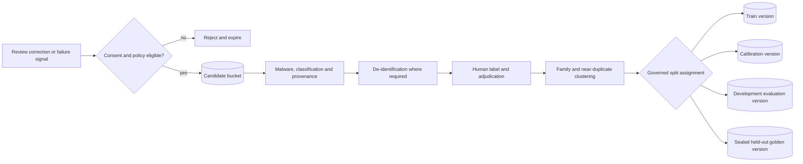
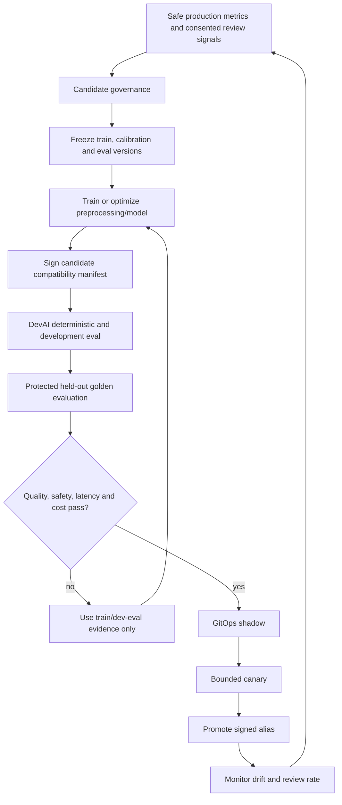

# Sandbox, evaluation and training data design

## Outcome

Document Intelligence needs a safe place to exercise the OCR service and its
agent integrations, a governed corpus for improving models and preprocessing,
and a sealed benchmark that proves those changes generalize. These are separate
trust and data-use boundaries. A convenient shared bucket would allow accidental
production-data use, benchmark leakage and unrepeatable evaluations.

This document defines logical placeholders. Physical GCS names, projects,
regions, identities, KMS policy and budgets are approved and delivered through
GitOps in `tesserix/tesserix-k8s#916`.

Products never receive these bucket identities. They integrate with Document
Intelligence through the same versioned service API, generated client libraries
or the provider-neutral Australis tool. Dataset manifests retain product/source
provenance and policy without turning any one product into the owner of the
shared engine or evaluation platform.

## Initial operating guardrails

These are starting safety and cost limits, not product forecasts:

| Dimension | Initial design point |
| --- | --- |
| Sandbox admission | 2 jobs/s and 10 pages/s globally; at most 5 active jobs per user |
| Sandbox input | Same 100 MiB/300-page hard parser bounds as production |
| Sandbox object lifetime | 24 hours by default, 72 hours maximum by approved run policy |
| Evaluation scratch lifetime | 24 hours; redacted aggregate reports retained 30 days |
| Nightly evaluation throughput | Capped at 25 pages/s so it cannot starve shared workloads |
| Training concurrency | One run per approved accelerator pool until capacity is measured |
| CI from forks | No cloud credentials, corpus access, model registry access or Langfuse secrets |

Every run has page, accelerator-hour, storage-byte, provider-spend and wall-time
budgets. A missing budget fails admission. These limits must be replaced with
measured values before production qualification.

## Logical GCS storage classes

Do not create one bucket per run, agent or document. Use buckets by trust and
lifecycle class, then opaque run/dataset/case paths inside them.

| Logical placeholder | Content | Default lifecycle | Allowed provenance |
| --- | --- | --- | --- |
| `nonprod-document-intelligence-sandbox` | Ephemeral inputs, derived pages and agent/OCR outputs | Delete after 24 hours; bounded lease up to 72 hours | Synthetic, public or explicitly de-identified non-production fixtures |
| `nonprod-document-intelligence-dataset-candidates` | Quarantined samples nominated for possible corpus use | Delete rejected candidates within 30 days | Consented nomination plus provenance record; not yet trusted for training |
| `nonprod-document-intelligence-training` | Immutable train and calibration dataset versions | Dataset-governance retention | Approved, licensed, de-identified where required and human-reviewed cases only |
| `nonprod-document-intelligence-eval-corpus` | Immutable development/regression evaluation versions | Dataset-governance retention | Synthetic, public or approved non-sensitive cases suitable for non-production runners |
| `nonprod-document-intelligence-eval-results` | Redacted predictions, metric inputs, reports and scratch | Scratch 24 hours; redacted reports 30 days unless promoted as evidence | Outputs only; no unrestricted source-document copies |
| `nonprod-document-intelligence-model-staging` | Signed candidate model and compatibility bundles | Keep active candidate plus bounded rollback history | Reproducible training/build outputs that passed supply-chain checks |
| `protected-document-intelligence-golden` | Sealed held-out golden test corpus | Separate protected governance policy | Approved benchmark cases; never a training input |

A separate non-production GCP project is preferred. If platform constraints keep
these buckets in a shared project, separate service accounts, Workload Identity,
KMS keys, bucket IAM and automated deny tests are mandatory. Every product's
production document buckets and Langfuse credentials are outside all sandbox,
training and ordinary CI identities.

Example non-sensitive object names are:

```text
runs/{run_id}/inputs/{case_id}/{source_digest}
runs/{run_id}/artifacts/{step}/{artifact_digest}
candidates/{candidate_id}/objects/{object_digest}
datasets/{dataset_id}/versions/{manifest_digest}/cases/{case_id}/{media_role}
training-runs/{training_run_id}/outputs/{artifact_digest}
models/{model_family}/candidates/{compatibility_digest}/{artifact_role}
evaluations/{experiment_id}/results/{result_digest}
```

Names contain no tenant name, filename, email, patient/customer name, label value
or other business content. Every reference includes exact GCS generation and
SHA-256 digest in the CNPG registry.

## Agent-scoped dataset namespaces

Dataset ownership is per agent and capability. One universal score would hide
different tools, risks and success criteria. A logical manifest view is:

```text
datasets/
├── customer-support-agent/
│   ├── normal-queries/
│   ├── tool-selection/
│   ├── policy-compliance/
│   └── adversarial/
├── ocr-agent/
│   ├── invoices/
│   ├── receipts/
│   ├── handwriting/
│   └── poor-quality-scans/
└── sre-agent/
    ├── kubernetes/
    ├── incident-analysis/
    ├── safe-remediation/
    └── permission-boundaries/
```

This tree is a registry/manifest namespace, not a requirement to expose raw GCS
prefix listing. Each case is addressed by opaque ID and immutable manifest. An
agent evaluation case has a constrained expected outcome rather than requiring
one exact natural-language answer:

```json
{
  "schema_version": "agent-eval-case/v1",
  "agent": "ocr-agent",
  "case_id": "opaque-case-id",
  "input_ref": {
    "object_digest": "sha256:...",
    "generation": "immutable-generation"
  },
  "expected_outcome": {
    "required_facts": [],
    "acceptable_ranges": {},
    "required_citations": [],
    "output_schema_digest": "sha256:..."
  },
  "required_tools": [],
  "forbidden_actions": [],
  "forbidden_claims": [],
  "evaluation_rules": [],
  "safety_boundaries": [],
  "tags": ["invoice", "low-resolution", "english"]
}
```

Sensitive values stay in referenced encrypted objects. The registry record adds
provenance, classification, consent/licence, residency, retention, split,
document-family/duplicate cluster, label/adjudication version and allowed-use
policy. Case schemas are versioned and bounded; arbitrary evaluator code cannot
be supplied inside a dataset case.

## Identity and access matrix

| Identity | Sandbox | Candidates | Training | Dev eval corpus | Eval results | Model staging | Sealed golden |
| --- | --- | --- | --- | --- | --- | --- | --- |
| Developer/local | bounded API only | nominate metadata | none | none | own safe summary | none | none |
| PR workflow | none | none | none | none; repository fixtures only | CI summary only | none | none |
| Sandbox runner | read/write leased prefix | nominate opaque reference | none | read approved version | write run prefix | read approved candidate | none |
| Dataset curator | bounded reviewed read | read/adjudicate | publish frozen versions | publish approved versions | none | none | proposal only |
| Training runner | none | none | read frozen train/calibration | none | write training metrics | write candidate prefix | none |
| Nightly evaluator | none | none | none | read one frozen version | write experiment prefix | read candidate/baseline | none |
| Protected evaluator | none | none | none | optional read | write protected experiment prefix | read candidate/baseline | read one frozen version |
| Promotion controller | none | none | manifests only | manifests only | read signed decision | promote signed alias | manifests only |
| Lifecycle controller | delete expired | delete rejected/expired | policy delete | policy delete | delete expired | policy delete | governed deletion only |

No identity has `storage.admin`. The training runner cannot read either evaluation
corpus. The protected evaluator can read but never mutate a frozen golden version.
DevAI asks runners to execute opaque run specifications; it does not receive raw
corpus bytes or permanent/signed object URLs.

## Dataset admission and split sealing



Admission never moves a mutable object in place. The curator writes a new
content-addressed object, verifies its digest/generation and freezes an immutable
manifest in CNPG. Split assignment is by document family, template and
near-duplicate cluster, not individual page, so related samples cannot cross
train/calibration/evaluation boundaries.

The test split is sealed before tuning begins. Engineers, training jobs and
ordinary evaluation jobs cannot list or read it. The protected evaluator returns
only approved aggregate/per-cohort scores and safe case IDs for failures. A test
case cannot be moved into training without creating a new dataset lineage and a
new independently reviewed held-out test version.

## CNPG registry additions

Global CNPG remains authoritative for governance and experiment state; GCS owns
bytes. Extend the `ocr_evaluation` model with:

- `storage_classes` and `purpose_policies` for allowed provenance, use and TTL;
- `dataset_access_grants` binding an identity, frozen version, purpose and expiry;
- `dataset_lineage` connecting candidates, labels, split decisions and derived versions;
- `training_runs` with code, dataset, hyperparameter, seed, runtime and hardware digests;
- `model_candidates` with artefact digest, SBOM, signature and compatibility manifest;
- `evaluation_runs` with candidate/baseline, metric implementation and environment digests;
- `budget_reservations` for pages, accelerator time, provider cost and storage;
- `deletion_operations` and append-only audit/outbox events.

The registry grants a frozen version, not a mutable bucket prefix. Creating an
access grant and budget reservation is one short transaction. Runner execution,
GCS access and Langfuse export happen after commit and are idempotently driven by
the outbox.

## Agent and OCR engineering loop



The deployable compatibility manifest binds the Rust engine image, models,
preprocessing transforms, confidence calibration, extraction/validation schemas,
route policy, agent version, Australis tool contract, result schema, runtime and
minimum hardware. DevAI compares candidate and baseline on the same frozen
dataset, metrics, runtime and hardware. Rollback moves the alias back to the
previous signed compatibility manifest.

Training uses only train data. Threshold selection and confidence calibration
use only calibration data. Developers diagnose against development evaluation
data. The held-out golden set is evaluated only by the protected release gate;
its results cannot be used repeatedly as a tuning dashboard.

## CI/CD and Langfuse

| Stage | Storage access | Langfuse | Required result |
| --- | --- | --- | --- |
| Pull request/fork | Repository synthetic/public fixtures only | None or local mock | Contract, unit, property, fuzz, security and deterministic agent assertions |
| Internal merge/nightly | One frozen development-eval version | Dedicated non-production evaluation project | Candidate/baseline cohort quality, latency, memory and cost |
| Training | One frozen train/calibration grant | Dedicated non-production training/evaluation project if traces are needed | Signed candidate plus reproducibility record |
| Protected release | One frozen sealed-golden grant | Dedicated protected evaluation project/credentials | Release decision and redacted evidence |
| Shadow/canary | Consented policy-eligible traffic only | Environment-specific safe traces | SLO, unsafe-accept, review, cost and rollback decision |

No product's production Langfuse credentials are used by sandbox, training,
DevAI, local development, PR or fork workflows. Langfuse receives opaque run/case
IDs, version digests, cohort tags, safe metrics, latency, cost and trace links.
It receives no corpus bytes, ground-truth values, signed URLs or unrestricted OCR
text. CNPG remains authoritative if Langfuse is unavailable.

## Failure, deletion and abuse handling

- Sandbox or evaluation outage does not affect production document processing.
- Training outage leaves the last signed model active and produces no partial promotion.
- A budget reservation prevents runaway retries or accelerator/provider spend.
- Duplicate run requests resolve to one run ID and result through a unique idempotency key.
- A crash leaves TTL-bound scratch or an unreferenced immutable object for the sweeper.
- Dataset withdrawal creates a new manifest, revokes future grants and evaluates which models/promotions are affected; history is never silently rewritten.
- Poisoning controls include source diversity caps, tenant/cohort sampling limits, human adjudication, anomaly review and reproducible label provenance.
- Malware, decompression bombs, prompt injection and hostile PDFs stay untrusted even after admission; every execution repeats bounded parsing in a sandbox.

## Review gates

- Approve physical bucket names, owning projects, regions, KMS and lifecycle rules.
- Approve every Workload Identity and prove cross-environment and held-out-test denies.
- Approve corpus licences, consent, residency, de-identification and withdrawal policy.
- Approve CNPG schema/roles, budget model, backup/restore and audit retention.
- Establish baseline cohort thresholds for OCR, agent grounding/safety, latency and cost.
- Exercise dataset freeze, test-leakage denial, scratch expiry, credential denial,
  model signing, promotion and one-action rollback before enabling protected data.
